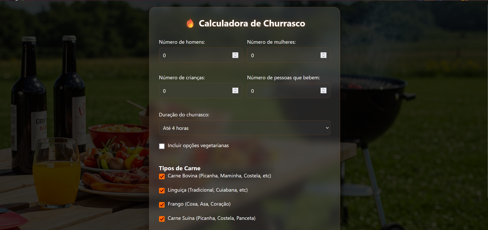

# Calculadora de Churrasco

### Tela Inicial

Esta é uma aplicação web simples para calcular a quantidade de carne, bebidas e acompanhamentos necessários para um churrasco, com base no número de pessoas e na duração do evento.

## Funcionalidades

- Calcular a quantidade de carne bovina, linguiça, frango e carne suína.
- Incluir opções vegetarianas.
- Calcular a quantidade de pão de alho, sal grosso, farofa, arroz, cerveja, refrigerante, gelo e carvão.
- Estimar o custo total do churrasco.

## Como Usar

1. Abra o arquivo `index.html` em um navegador web.
2. Preencha os campos com o número de homens, mulheres, crianças e pessoas que bebem.
3. Selecione a duração do churrasco.
4. Marque a opção para incluir vegetarianos, se necessário.
5. Marque os tipos de carne que serão servidos.
6. Clique no botão "Calcular".
7. Veja os resultados exibidos na tela.

